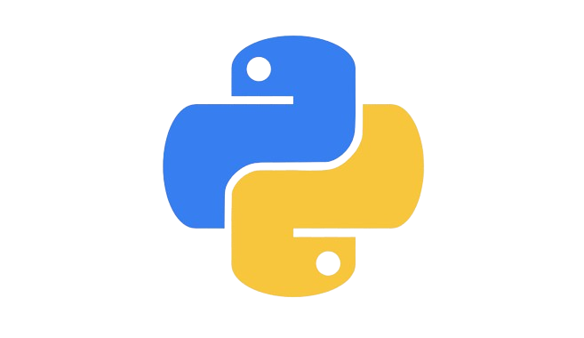
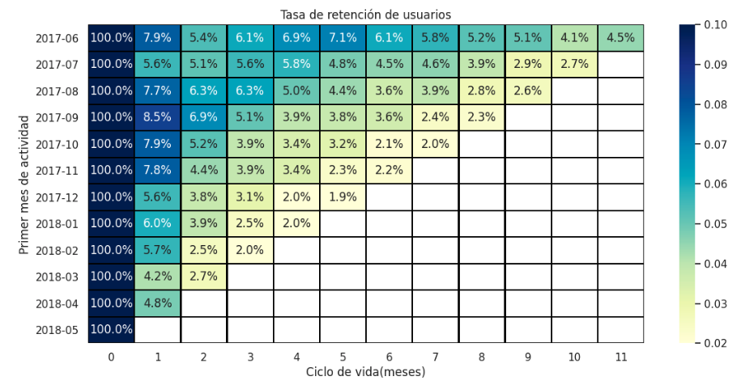

# ¡Hola, bienvenido a mi portfolio! 👋  

## Perfil profesional 
Analista de datos, con experiencia en Análisis Exploratorio de Datos (EDA) y comprensión de los procesos de negocio. Manejo herramientas como Excel, Python, SQL y Power BI, con enfoque en la manipulación, limpieza y visualización de datos, además de la creación de informes con métricas relevantes. Me destaco por mi capacidad de aprendizaje rápido y por colaborar eficazmente en equipos. Estoy motivado por aplicar mis habilidades, contribuyendo al análisis y presentación de datos para respaldar decisiones estratégicas.

<h2> Mi Stack de" Herramientas</h2> 

    
    
    
    
    

 

## Formación educativa 
* Certificado de formación nivel 3: Analista de datos profesional  SEP - PFBEC  Enero 2025
* Data Analyst  TripleTen Latam  Mayo 2024 - Diciembre 2024
* Desarrollador Java Full Stack  Generation México  Mayo 2023 - Julio 2023 
* Diplomado en estadística y análisis de datos con SPSS  IEFPI  Mayo 2021 - Enero 2022 
* Licenciado en Psicología (cfr. 12688554)  UNAM  Agosto 2014 - Mayo 2018

## Experiencia laboral 
1. Junior Consultant IT | VASS Latam | CDMX | Enero 2024 - Abril 2024
    * Colaboré con el equipo de front-end y QA, identificando incidencias en el website de la Bolsa Mexicana de valores. 
    * Realicé pruebas en el sitio web de la Bolsa Mexicana de Valores (BMV) utilizando Katalon Studio, para identificar y reportar incidencias.
    * Generé reportes de las incidencias en Google Sheets para que el equipo de front-end los solucionará.
    * Colaboré con la creación de la documentación de pruebas aplicadas por el equipo de QA.

2. Quality Assurance (Freelance) | Scale AI | CDMX | Marzo 2022 - Diciembre 2023
    * Formé parte del equipo de control de calidad encargado de entrenar modelos de inteligencia artificial en la plataforma Remotasks, asegurando respuestas precisas y efectivas a diversas consultas.
    * La mayoría de los proyectos en los que participé se centraron en revisar las respuestas de otros equipos de control de calidad, garantizando soluciones óptimas y mejorando la precisión de los modelos de inteligencia artificial.

3. Auxiliar administrativo | Sistelnetworks | Estado de México | Octubre 2019 - Agosto 2020
    * Amplia experiencia en atención al cliente, enfocada en brindar un servicio de calidad y satisfacer las necesidades de los usuarios.
    * Auxiliar en los procesos de reclutamiento y selección de personal en puestos generales.
    * Gestión de pedidos, mantenimiento de bases de datos para garantizar la calidad de la información y su actualización constante.
    * Planificación y coordinación logística de eventos para garantizar su éxito y eficiencia operativa.

## Proyectos relevantes

### 📊 Optimizar gastos de Marketing en Showz [Link proyecto completo](https://github.com/Hectorcidps/Portfolio_DA/tree/master/Proyecto%206%20-%20Optimizar%20los%20gastos%20de%20Marketing)

El departamento de analítica de Showz, una empresa de venta de entradas para eventos, solicitó ayuda para optimizar sus gastos de marketing.

El proyecto se desarrolló en tres fases:

* Preprocesamiento de datos: Limpieza y preparación.
* Análisis y métricas clave: Evaluación de conversión, retención, LTV, CAC y ROMI.
* Recomendaciones estratégicas: Identificación de oportunidades y áreas de mejora.

📌 Hallazgos clave:
- ✅ Canal 9 resultó ser el más eficiente, con alta retención y el menor costo de adquisición.
- ⚠️ Canal 3 presentó una conversión menor al 20%, altos costos y el peor rendimiento.
- 💡 Se recomienda redistribuir el presupuesto hacia canales más rentables y reducir la inversión en aquellos con pérdidas.

Los resultados muestran que, a pesar del alto tráfico y conversión en algunos canales, la empresa sigue enfrentando pérdidas debido a una asignación ineficiente del presupuesto de marketing.

